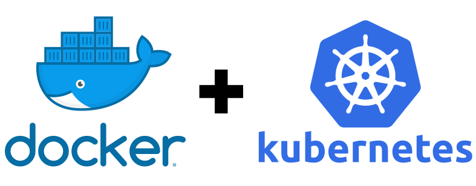

# infrastructure

## Usage

To deploy everything, use `go run apply.go` which requires kubectl.

## License

This is free and unencumbered software released into the public domain. See the [UNLICENSE](UNLICENSE) file for more details.
